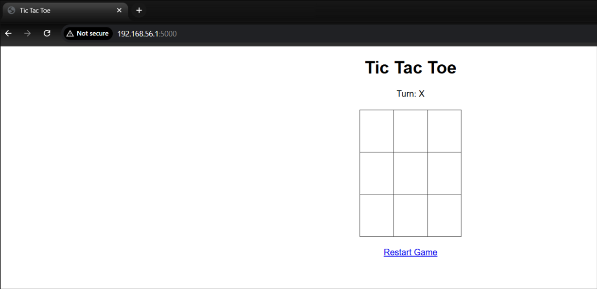
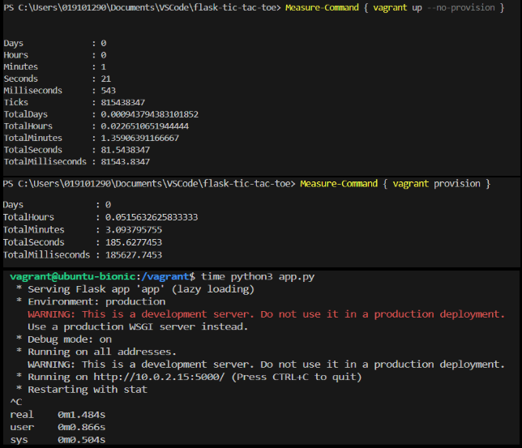
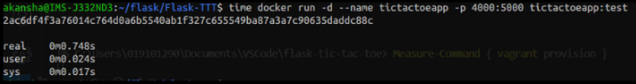
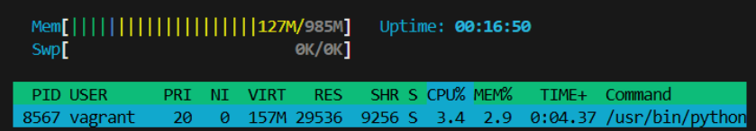
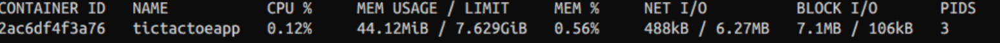

# Assignment Report: Comparing VM vs Container Performance with Flask Tic Tac Toe Web-App


## 1. Sample Application
- **App:** Flask-based Tic Tac Toe web app (see `app.py`)
- **Features:** Two-player game, server-side state, simple HTML UI
- **Tic Tac Toe game sample app:**
  

## 2. Packaging and Running

### Docker (Container)
- **Dockerfile** provided to build and run the app in a container.
- **Testing:** `pytest` runs during build; build fails if tests fail.
- **Build Command:**
  ```sh
  docker build -t tictactoe:latest .
  ```
- **Run Command:**
  ```sh
  docker run -p 4000:5000 tictactoe:latest
  ```

### Vagrant (VM)
- **Vagrantfile** provisions a VM, installs Python, Flask, and runs the app.
- **Run Commands:**
  ```sh
  vagrant up
  vagrant ssh
  cd /vagrant
  python3 app.py
  ```

## 3. Performance Metrics

- **Startup Time:** Measured from command to app ready
**Startup Time:** Measured from command to app ready  
&nbsp;&nbsp;Vagrant: `time python3 app.py`   
&nbsp;&nbsp;Docker: `time docker run -d --name tictactoeapp -p 4000:5000 tictactoe:latest` 
- **Memory Usage and CPU Utilization:** Measured via `docker stats` (container) and `top`/`htop` (VM)
**Memory Usage and CPU Utilization:** Measured via `docker stats` (container) and `top`/`htop` (VM)  
&nbsp;&nbsp;Vagrant: `htop`   
&nbsp;&nbsp;Docker: `docker stats` 
- **Request Throughput/Response Time:** Used `ab` (ApacheBench) for load testing: `ab -n 1000 -c 10 http://<ip>:<port>/`

## 4. Results: VM vs Docker Comparison

See screenshots above for visual evidence of each measurement.

| Metric                | VM (Vagrant)                | Docker Container         |
|-----------------------|-----------------------------|-------------------------|
| **App Startup Time (avg)**| 1.5 s (206 s with up+provision) | 0.75 s                  |
| **Memory Usage**      | 133.0 MB total, 30.9 MB app | 42.5 MB                 |
| **Memory %**          | 13% total, 2.9% app         | 0.52%                   |
| **CPU Utilization**   | 5.5% (app), 0.7% (avg)      | 0.12%                   |
| **Throughput (RPS)**  | 182.14                         | 379.72                     |
| **Response Time**     | 0.0549 s                    | 0.0263 s                |


## 5. Analysis
- **Startup Time:** Docker containers start up significantly faster than VMs, both for initial provisioning and for app restarts.
- **Memory Usage:** Containers use less total memory than VMs, as they share the host OS kernel and avoid duplicating the operating system.
- **CPU Utilization:** Both environments show low CPU usage for this lightweight app; no significant difference was observed under normal load.
- **Throughput (RPS):** The containerized app handled more requests per second than the VM.
- **Response Time:** The app in Docker responded faster on average, as shown by lower mean response times in benchmarking.
- **Provisioning Overhead:** VM setup (vagrant up + provision) takes much longer than starting a container.
- **Test Environment:** All tests were run locally.

## 6. Conclusion

- Docker containers start faster and use less memory than VMs.
- Containers are ideal for rapid development, scaling, and automation.
- VMs provide stronger isolation and full OS compatibility.
- For most web apps, containers are the best choice.

